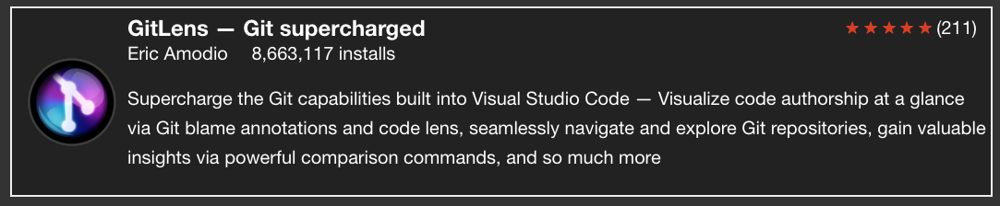

# gatsby-remark-vscode-embed

A Gatsby remark plugin to insert an embedded component for VS Code Extensions when you create a link in a markdown file that links to the VS Marketplace.

Here's an example outputted component with the GitLens extension. Do note it still is a clickable component that will link to the marketplace for said extension.



# Usage

download the package from npm

```
npm install gatsby-remark-vscode-embed
```

and add it as a plugin to `gatsby-transformer-remark` in your `gatsby-config.js` file

```js
 {
   resolve: 'gatsby-transformer-remark',
   options: {
     plugins: [
       'gatsby-remark-vscode-embed'
     ]
   }
 }
```

# Styling

By default, you can style the HTML generated through this plugin by default however you wish, but I have bundled some default styles in the package. To use them, in the file which you render your markdown, import the following file:

```js
import 'gatsby-remark-vscode-embed/style.css'
```
